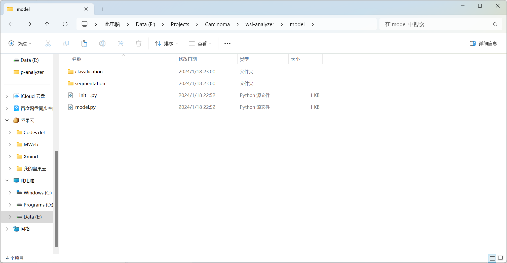
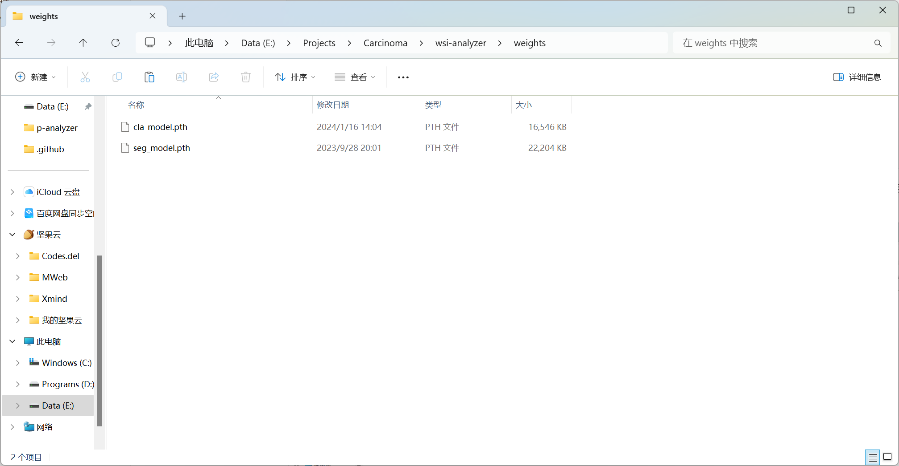

# 病理切片分析系统

## 环境

### 项目介绍

本项目为病理切片分析系统，可对医学图像当中的病理切片进行处理，并进行推理和分析。

该程序实现功能为：将一张或多张病理切片，输出各个切片的病理分析报告。

作者为[@li192863](https://github.com/li192863)，联系邮箱为li192863**1**@163.com，欢迎Fork以及PR。


### 环境要求

环境要求：Windows、Python、PyTorch、PySide6，若想打包使用，请安装PyInstaller。

1. 下载源码:

```shell
git clone https://github.com/li192863/wsi-analyzer.git # 下载源代码
cd wsi-analyzer                                        # 进入文件夹
```

2. 创建环境，建议创建Conda虚拟环境：

```shell
conda create -n wsi-analyzer python==3.8.1             # 创建虚拟环境
conda activate wsi-analyzer                            # 进入虚拟环境
```

3. 安装要求，Windows环境下，下载并解压[vips](https://github.com/libvips/build-win64-mxe/releases/tag/v8.14.5)，安装Python>=3.8.1、PyTorch>=1.13、PySide6>=6.6.1、PyVips>=2.2：

```shell
# 下载自己所需的vips，如果需要更换vips版本，请修改./utils/size_util.py
# 下载地址见 https://github.com/libvips/build-win64-mxe/releases/tag/v8.14.5
# 或者自行下载解压至./vips-dev-8.14
Invoke-WebRequest -OutFile ./vips.zip -Uri https://github.com/libvips/build-win64-mxe/releases/download/v8.14.5/vips-dev-w64-all-8.14.5.zip
tar -zxf ./vips.zip                                    # 解压下载文件
rm ./vips.zip                                          # 删除下载文件

pip install -r requirements.txt                        # 安装其他依赖
```

### 项目搭建

1. 放置模型，放置分割模型于`./model/segmentation`文件夹下，放置分类模型于`./model/classification`文件夹下，确保模型可被调用；



2. 调用模型，修改`./model/model.py`，调用自己的模型，确保返回类型为`nn.Module`类型；

```python
from torch import nn

from model.classification import *
from model.segmentation import *


def get_seg_model(classes) -> nn.Module:
    """
    获取分类模型，请手动修改该函数以适配自己的模型
    :param classes: 种类列表
    :return:
    """
    model = DeepLabV3Plus(len(classes), pretrained=False)
    model.eval()
    return model


def get_cla_model(classes) -> nn.Module:
    """
    获取分类模型，请手动修改该函数以适配自己的模型
    :param classes: 种类列表
    :return:
    """
    model = get_model_finetuning_the_convnet(len(classes))
    model.eval()
    return model
```

3. 放置权重，放置分割模型权重于`./weights/seg_model.pth`，放置分类模型权重于`./weights/cla_model.pth`，确保权重与模型一致，亦即使用`torch.load`可成功加载权重；



4. 修改配置，更改`./conf/settings.yml`中有关于`inferencer`的相关配置，主要包括模型类别（`classes`）以及推理尺寸（`inference_size`）

```yml
# 推理配置
inferencer:
  # 分割相关配置
  segmentation:
    # 推理时使用的权重
    weight: './weights/seg_model.pth'
    # 推理的种类
    classes: ['背景', '正常', '肿瘤']
    # 推理变形后大小 **[height, width]**
    inference_size: [1024, 1024]
    # 推理时批次的大小（值越大推理越快，但可能导致显存溢出） 填 2, 1
    batch_size: 2
    # 推理时使用的设备 填 null(自动选择), 'cuda', 'cpu'
    device: 'cpu'
  # 分类相关配置
  classification:
    # 推理时使用的权重
    weight: './weights/cla_model.pth'
    # 推理的种类
    classes: ['出血', '坏死', '实质', '淋巴', '空泡', '空白', '间质']
    # 推理变形后大小 **[height, width]**
    inference_size: [256, 256]
    # 推理时批次的大小（值越大推理越快，但可能导致显存溢出） 填 32, 16, 8, 4, 2, 1
    batch_size: 16
    # 推理时使用的设备 填 null(自动选择), 'cuda', 'cpu'
    device: 'cpu'
```

5. 运行`./main.py`。

```shell
python ./main.py
```


## 运行

### 运行原理

打开软件，软件首先加载默认配置，随后根据默认配置（`./conf/settings.yml`）生成当前运行配置（`./conf/running_set.yml`）。

选择文件，只可选择一个文件夹下的一个或多个文件，选择后如果再次点击选择文件，原有文件列表将被清空。

开始转换，软件将对病理切片进行切片处理，生成分割切片与分类切片，随后将对分割/分类切片进行推理，并将推理结果进行融合结果分析，最后生成报告文件，保存在目标文件夹下。

打开结果，软件将打开存放结果的文件夹，可对结果进行查看以及分析。

**注意**：界面配置始终优于运行配置，例如文件列表等，直接修改配置文件中文件列表选项将不起作用。

### 操作步骤

1. 修改默认配置，可通过“编辑”->“运行配置”修改本次运行配置，通过“编辑”->“默认配置”修改软件默认配置；
2. 修改界面配置，界面上列出最常用的一些配置，可进行修改，下次启动软件时配置将清空；
3. 选择文件，只可选择一个文件夹下的一个或多个文件，若再次点击选择文件则清空文件列表；
4. 开始处理，软件将对进行分割切片处理（0~20%）、分类切片处理（20%~40%）、分割切片推理（40%~60%）、分类切片推理（60%~80%）、生成结果报告（80%~100%）；
5. 打开结果，打开结果文件夹，`{切片名}_result/report.md`即为结果报告。

### 运行选项

* 自动恢复：软件将分别在20%、40%、60%、80%设置断点，若开启，软件再次以相同配置处理相同切片时会自动尝试恢复。例如，若对某一切片文件上次处理至36%后异常退出，相同切片选项且开启自动恢复情况下，软件再次处理该文件将从20%处继续运行。
* 强制推理：软件在40%~60%将进行分割切片推理，在60%~80%将进行分类切片推理，若开启，则软件最多恢复至40%，亦即推理始终会从头执行。该选项适用于模型权重发生更改时，需要重新推理时使用。
* 舍弃边缘：软件对病理切片处理时，对于超出切片高度和切片宽度的部分的处理策略可调整，若开启，超出部分将被丢弃，若关闭，超出部分将被保留。在推理时，超出部分会以空白像素填充至完整切片高度和切片宽度的大小，然后进行推理。

## 配置

默认配置文件为`./conf/settings.yml`，默认配置文件将影响软件启动时的配置。运行配置文件为`./conf/running_set.yml`，运行配置文件仅影响本次软件运行的结果。

点击“编辑”->“默认配置”将打开默认配置文件，点击“编辑”->“运行配置”将打开运行配置文件。注意，默认配置文件修改完成后必须重新启动软件才可使配置文件生效。

运行配置文件与默认配置文件所有配置选项相同，格式上有差异，但均遵循`YAML`格式规范。若默认配置文件损坏，可通过`./conf/settings.yml.bak`恢复。

配置文件共分为4部分，分别为基础配置、切片配置、推理配置以及结果配置，部分配置映射至界面。注意，界面配置始终优于运行配置。

```yml
# 基础配置
basic:
  # 文件列表 因为界面配置>运行配置 故修改该选项将不起作用 该选项映射至"选择文件"按钮
  filelist: []
  # 尝试自动恢复 填 True, False 该选项映射至"自动恢复"选项
  auto_resume: True
  # 强制重新推理（无论之前推理是否完成，仍进行推理） 填 True, False 该选项映射至"强制推理"选项
  force_inference: False
  # 输出地址 填 null(自动选择), '/path/to/result' 该选项映射至"输出地址"文本框或"选择文件夹"按钮
  result_folder: ''
```

### 切片配置

```yml
# 切片配置
slicer:
  # 分割相关配置
  segmentation:
    # 切片大小 [width, height] 该选项映射至"分割切片宽度"与"分割切片高度"文本框
    slice_size: [2048, 2048]
    # 降采样值 该选项映射至"分割切片降采样"文本框
    down_sample: 16
    # 文件前缀（不得包含特殊字符）
    prefix: ''
    # 文件后缀（默认文件格式，除'.'外不得包含特殊字符） 填'.jpg', '.png' 等
    suffix: '.jpg'
    # 是否采用内存加载（内存加载速度较快，但可能会导致内存溢出） 填 True, False
    memory: True
  # 分类相关配置
  classification:
    # 切片大小 [width, height] 该选项映射至"分类切片宽度"与"分类切片高度"文本框
    slice_size: [1024, 1024]
    # 降采样值  该选项映射至"分类切片降采样"文本框
    down_sample: 1
    # 文件前缀
    prefix: ''
    # 文件后缀（默认文件格式） 填'.jpg', '.png' 等
    suffix: '.jpg'
    # 是否采用内存加载（内存加载速度较快，但可能会导致内存溢出） 填 True, False
    memory: True
  # 切片器引擎 填 'base', 'vips'
  engine: 'vips'
  # 默认是否舍弃边缘 填 True, False 该选项映射至 舍弃边缘 选项
  drop_last: False
```

### 推理配置

```yml
# 推理配置
inferencer:
  # 分割相关配置
  segmentation:
    # 推理时使用的权重
    weight: './weights/seg_model.pth'
    # 推理的种类
    classes: ['背景', '正常', '肿瘤']
    # 推理变形后大小 **[height, width]**
    inference_size: [1024, 1024]
    # 推理时批次的大小（值越大推理越快，但可能导致显存溢出） 填 2, 1
    batch_size: 2
    # 推理时使用的设备 填 null(自动选择), 'cuda', 'cpu'
    device: 'cpu'
  # 分类相关配置
  classification:
    # 推理时使用的权重
    weight: './weights/cla_model.pth'
    # 推理的种类
    classes: ['出血', '坏死', '实质', '淋巴', '空泡', '空白', '间质']
    # 推理变形后大小 **[height, width]**
    inference_size: [256, 256]
    # 推理时批次的大小（值越大推理越快，但可能导致显存溢出） 填 32, 16, 8, 4, 2, 1
    batch_size: 16
    # 推理时使用的设备 填 null(自动选择), 'cuda', 'cpu'
    device: 'cpu'
```

### 结果配置

```yml
# 结果配置
result:
  # 分割相关配置
  segmentation:
    # 除去前后缀外切片命名格式
    naming_regex: 'd(\d+)_r(\d+)_c(\d+)'
    # 输出图形选项
    summary_image:
      # 是否显示图片
      show_image: False
      # 图片选项
      plot_kwargs:
        # 颜色映射，详见 https://matplotlib.org/stable/users/explain/colors/colormaps.html
        cmap: 'plasma'
      # 保存选项
      save_kwargs:
        # 分辨率dpi(dots per inch)
        dpi: 1024
  # 分类相关配置
  classification:
    # 除去前后缀外切片命名格式
    naming_regex: 'd(\d+)_r(\d+)_c(\d+)'
    # 输出图形选项
    summary_image:
      # 是否显示图片
      show_image: False
      # 图片选项
      plot_kwargs:
        # 颜色映射，详见 https://matplotlib.org/stable/users/explain/colors/colormaps.html
        cmap: 'viridis'
      # 保存选项
      save_kwargs:
        # 分辨率dpi(dots per inch)
        dpi: 1024
```
