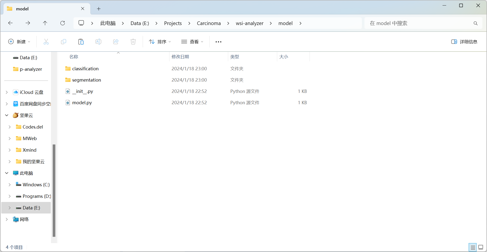

# 分类模型文件夹

放置分割模型于`./model/segmentation`文件夹下，放置分类模型于`./model/classification`文件夹下，确保模型可被调用。

请事先准备好训练好的PyTorch分类模型，并修改`./model/classification/__init__.py`使其可被`./main.py`调用。

出于代码隐私考虑，本人模型代码部分不予展示。

目录示例：

