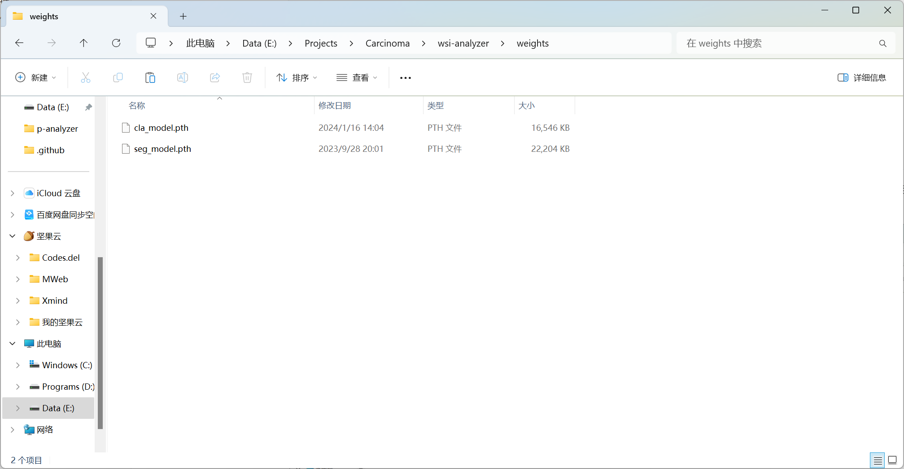

# 权重文件夹

放置分割模型权重于`./weights/seg_model.pth`，放置分类模型权重于`./weights/cla_model.pth`。

请确保权重与模型一致，亦即使用`torch.load`可成功加载权重。相关代码如下：

```python
# 加载权重
self.model.load_state_dict(torch.load(weight, map_location=torch.device(self.device)))
```

目录示例：

